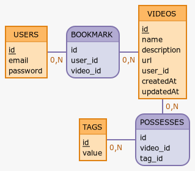

# On Rewind

Technical test for On Rewind

## Database structure

### Diagram



### Logical Data Model

```
VIDEOS(id, name, description, url, user_id, createdAt, updatedAt)
TAGS(id, value)
_m2m_TAGS_VIDEOS(id, video_id, tag_id)

USERS(id, email, password)
_m2m_USERS_VIDEOS_bookmarks(id, user_id, video_id)
```

# Running the app with Docker

Please run following command

```bash
docker-compose up -d
```

# Running the app without Docker

## Install dependencies

Before running the app first install dependencies runing following command

```bash
npm install
```

## PostgreSQL

To run project please first create a PostgreSQL role and database to be use

---

### Create Role

Example

example: 
```bash
CREATE ROLE "onrewind" WITH LOGIN PASSWORD '%/#tb8Jg5#.zLtVV';
```

### Create database

---

Example

example: 
```bash
CREATE DATABASE "onrewind" OWNER "onrewind";
```

## Setup your .env file

To make Sequelize connect securely with PostgreSQL, please first create a `.env` file at the same level as the `.env-example` file and fill it with the right values.

Example with previous PostgreSQL database and role. You can also provide a specific port wich be used instead of 3000 by default (3030 in this case). ACCESS and REFRESH token SECRETS will be used to manage private rooutes with an Authorization request header.

Example

```
PORT=3030

DATABASE_USERNAME=onrewind
DATABASE_PASSWORD=%/#tb8Jg5#.zLtVV
DATABASE_NAME=onrewind

ACCESS_TOKEN_SECRET=Ss}L{f=HMCp84rH^hG.B}";&ub>#jvte4d
REFRESH_TOKEN_SECRET=`5(mP{\$z2'[VP9FzHs@^B!RVzGGJyC&^e

```

## Seeding the database

If needed, to seed the database with some datas, make sure your at the root folder and please run following command with your `<DATABASE_ROLE>` and providing your database password when asked.

```bash
psql -U <DATABASE_ROLE> -f data/seed.sql
```

## Running the API

Can be performed running following command

```bash
npm run dev
```

## Running the tests

Can be performed running following command

```
npm run test
```
